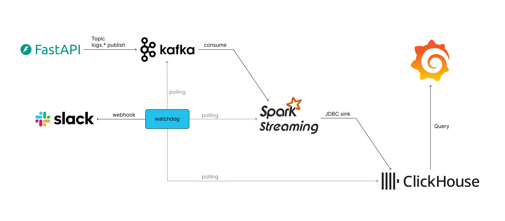

# Log ETL & Monitoring PoC Project

## 개요

[ 이미지 준비 중...] 

대규모 로그 데이터에 대한 **수집, 처리, 모니터링**을 목표로 하는 **PoC(Proof of Concept) 프로젝트**입니다.

- 대용량 이벤트 로그를 실시간으로 수집‧가공‧시각화하는 파이프라인을 검증했습니다. 
- FastAPI 기반 시뮬레이터가 Kafka 로그 토픽에 다양한 서비스 패턴을 발행하면, Spark Structured Streaming 잡이 이를 ClickHouse 분석 테이블로 적재하고 Grafana 대시보드로 노출합니다. 각 컴포넌트는 Docker Compose로 손쉽게 기동할 수 있으며, ClickHouse 초기 스키마와 Grafana 프로비저닝도 자동화되어 있어 부팅 직후부터 엔드투엔드 흐름을 검증할 수 있습니다.


## 기술 스택

| 아이콘 | 설명 |
| --- | --- |
|  | FastAPI: log_gateway 시뮬레이터 및 API 엔드포인트 |
|  | Apache Kafka + Kafka UI: 로그 수집 버퍼와 모니터링 UI |
|  | Apache Spark 4.0 Structured Streaming: Kafka → ClickHouse 실시간 적재 |
|  | ClickHouse: OLAP 테이블에 로그 저장 |
|  | Grafana: ClickHouse 데이터 소스로 대시보드 시각화 |
|  | Docker / Docker Compose: 전체 개발 환경 오케스트레이션 |
|  | Python 3.10: 시뮬레이터, Watchdog 스크립트 등 보조 유틸 |
|  | Linux (Ubuntu 기반): VM 환경 및 파일 시스템 레이아웃 |
|  | Slack Webhook: Watchdog 알림 채널 연동 |


## 시스템 아키텍처



1. **로그 생성/수집**
   - `log_gateway/generator.py` 가 서비스별 트래픽 믹스·시간대 가중치·오류율을 반영해 HTTP 이벤트를 생성합니다.
   - FastAPI 앱이 `/ping` 헬스체크와 함께 generator를 백그라운드 태스크로 실행해 지속적으로 로그를 만들어 냅니다.
2. **로그 브로커/버퍼링**
   - Kafka 단일 노드가 `logs.auth`, `logs.order`, `logs.payment`, `logs.notify`, `logs.error` 토픽에서 생산자와 소비자 사이 메시지 큐 역할을 합니다.
   - Kafka UI를 통해 토픽/파티션 상태와 소비량을 확인하고 필요 시 수동 토픽 관리(생성/삭제)를 수행합니다.
3. **로그 실시간 처리**
   - `spark_job/main.py` 가 Structured Streaming으로 `logs.*` 패턴을 구독하고, `fact_log.parse_fact_log()` 로 스키마 정규화를 수행합니다.
   - Spark 스트림은 `/data/spark_checkpoints` 체크포인트를 활용해 장애 복구 시점을 유지합니다.
4. **로그 저장**
   - `spark_job/warehouse/writer.py` → `write_to_clickhouse()` 가 ClickHouse `analytics.fact_log` 테이블에 JDBC append 합니다.
   - 초기 스키마는 `spark_job/warehouse/create_tables.sql` 로 자동 생성되며, `data/clickhouse` 볼륨에 영속화됩니다.
5. **로그 시각화 및 모니터링**
   - Grafana는 프로비저닝된 ClickHouse 데이터 소스로 EPS, 오류율, 상태 코드 분포 등을 시각화합니다.
   - `monitor/docker_watchdog.py` 는 Kafka/Spark/ClickHouse/Grafana 컨테이너 이벤트와 로그를 감시해 OOM, StreamingQueryException, health 변화를 Slack Webhook/CLI로 통지합니다.


## 실행 방법

```bash
# 0. 사전 준비
# - Docker / Docker Compose 설치
# - VM이라면 /data 파티션을 미리 마운트하고 아래 디렉터리를 생성해 rw 권한을 부여한다.
#     sudo mkdir -p /data/kafka-logs /data/kafka-meta /data/spark_checkpoints \
#                  /home/kang/log-monitoring/data/clickhouse/{data,logs} \
#                  /home/kang/log-monitoring/data/grafana
#     sudo chown -R $USER:$USER /data /home/kang/log-monitoring/data
# - 방화벽/보안 그룹에서 29092(Kafka), 4040(Spark UI), 3000(Grafana) 등을 허용

# 1. Kafka + Kafka UI만 우선 기동 (토픽/메시지 확인용)
docker compose up -d kafka kafka-ui

# 2. Spark, ClickHouse, Grafana 파이프라인 기동
docker compose up -d spark clickhouse grafana spark

# 3. 로그 시뮬레이터 기동
docker compose up -d simulator

# 4. 상태 점검
docker compose ps
curl http://localhost:8000/ping                 # log_gateway FastAPI
curl http://localhost:4040/api/v1/applications  # Spark UI REST

# 5. (선택) CLI 모니터링
python monitor/docker_watchdog.py
```
추가 확인 포인트:
- Kafka UI(http://localhost:8080)에서 `logs.*` 토픽 메시지 수신 여부를 확인합니다.
- ClickHouse에 적재되는 데이터는 `docker exec -it clickhouse clickhouse-client --query "SELECT count() FROM analytics.fact_log"` 로 조회할 수 있습니다.
- Grafana(http://localhost:3000, 기본 계정 `admin` / `admin`)에서 ClickHouse 데이터 소스와 대시보드를 통해 지표를 확인합니다.


## 목표

- 대규모 로그 스트림을 실시간 제약 하에서도 안정적으로 처리할 수 있는지 검증
- FastAPI → Kafka → Spark → ClickHouse → Grafana로 이어지는 엔드투엔드 파이프라인이 요구 성능과 지연 목표를 충족하는지 확인
- 각 단계 별 병목 지점을 식별하고 개선 방안 도출
- Slack 연동 Watchdog과 Grafana 대시보드로 최소 운영 감시 체계를 구성하고, 실시간 알림/가시성 확보 가능성을 검증


## 향후 계획

- 이벤트 로그 외에도 시스템 로그, 애플리케이션 에러 로그 등 다양한 소스별 파이프라인을 확장해 멀티 로그 수집 인프라로 고도화합니다.
- ClickHouse Dim 테이블(시간/서비스/상태 코드 등)을 생성하고 Spark 스트림에서 주기적으로 동기화하여 추가 분석 지표를 확보합니다.
